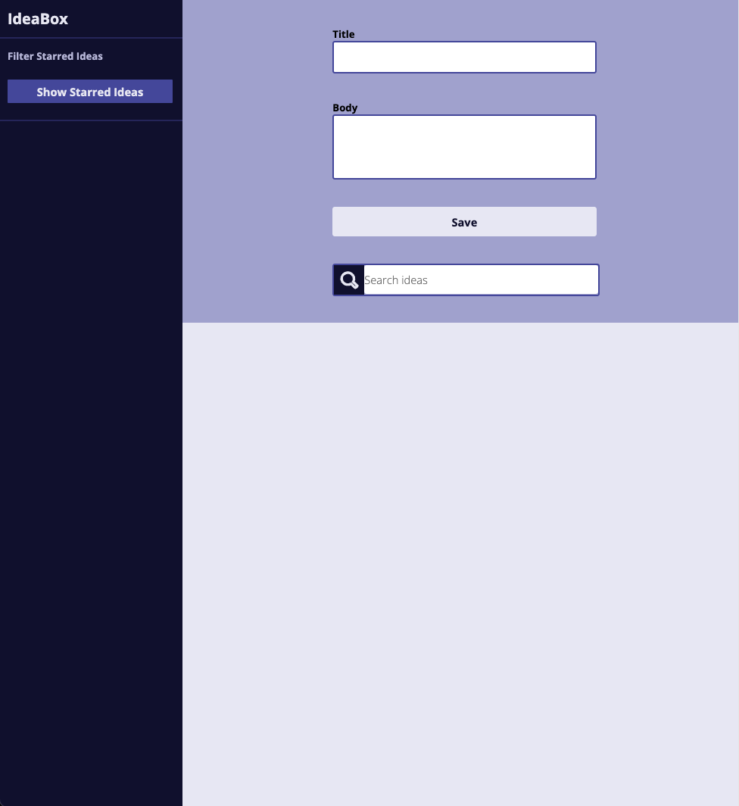

### Abstract:
[//]: <> (Briefly describe what you built and its features. What problem is the app solving? How does this application solve that problem?)
We built a webpage that allows users to input ideas with a title and body into a form that creates cards with that idea on them. These ideas can be starred to indicate favorite ideas and deleted from the users saved cards. The user has the option to view their starred ideas or view them all. Users can also use the search bar to instantaneously filter through their ideas by keywords. 

### Installation Instructions:
[//]: <> (What steps does a person have to take to get your app cloned down and running?)
- First, clone the SSH code from this [link](https://github.com/FayeRosenshein/ideabox) to your local computer
- Second, open in your text editor 
- Third, read the README.md 
- Fourth, in the terminal, run the coommand open index.html for initial deployment and interaction with app

### Preview of App:
[//]: <> (Provide ONE gif or screenshot of your application - choose the "coolest" piece of functionality to show off.)

### Context:
[//]: <> (Give some context for the project here. How long did you have to work on it? How far into the Turing program are you?)
We are all mod 1 students. We have worked approximately 15-18 hours on this project.

### Contributors:
[//]: <> (Who worked on this application? Link to their GitHubs.)
1. Derek's [LinkedIn](https://www.linkedin.com/in/derekyeh/) [Github](https://github.com/derekgithub2)
1. Rae's [LinkedIn](https://www.linkedin.com/in/rae-gebhart-681449254/) [Github](https://github.com/rae-107)
1. Faye's [LinkedIn](https://www.linkedin.com/in/faye-rosensehin-8ba421242/) [Github](https://github.com/FayeRosenshein/)

### Learning Goals:
[//]: <> (What were the learning goals of this project? What tech did you work with?)
- Gain an understanding of how to write clean HTML and CSS to match a provided comp.
- Understand what it looks like to have a separate data model (using a class) and DOM model.
- Incorporate & iterate over arrays in order to filter what is being displayed.
- Craft code with clean style, using small functions that show trends toward DRYness and SRP.

### Wins + Challenges:
[//]: <> (What are 2-3 wins you have from this project? What were some challenges you faced - and how did you get over them?)
##### Wins
1. We worked efficiently and effectively as a group without any conflicts.
1. Properly and efficiently utilizing our class to class interaction.

##### Challenges
1. Finding the exact styling as the composition was challenging. We came to the agreement to not overcomplicate things while matching the composition.
1. Event delegation is still challenging as well. We asked other groups for advice and worked together to get the results we were looking for.
